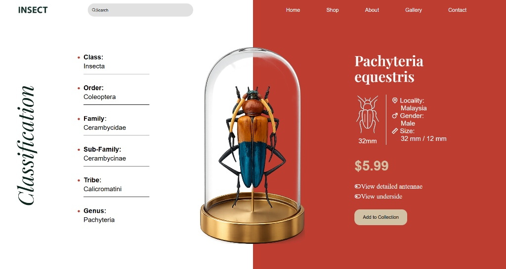

# Insect Classification Interface - Static CSS Layout

A static front-end layout clone of an editorial insect catalog landing page, focusing on pixel-perfect alignment, typography pairing, and asymmetric layouts. Built as an assignment for **Sheryians Coding School Cohort 3.0**.



---

## The Technical Focus

This assignment was engineered entirely from scratch to practice advanced positioning mechanics using raw, semantic code structure without external CSS frameworks.

* **Split-Screen UI Architecture:** Designed a sharp vertical split-screen using linear gradient.
* **Element Layering:** Implemented Flex Layouts.
* **Typography Pairing:** Balanced italicized vertical display text (`Classification`) alongside clean tabular layout data blocks on the left and serif headers on the right, Used transform property and vertical reading.

---

## Tech Stack Implemented

- **HTML5:** Semantic architecture blocks (`<nav>`, `<main>`, lists)
- **CSS3:** Flexbox layouts, strict explicit alignment tokens, and custom relative/absolute positioning parameters

---

## Local View

1. Clone this repository locally:
```bash
   git clone [https://github.com/YOUR_USERNAME/REPOS_NAME.git](https://github.com/YOUR_USERNAME/REPOS_NAME.git)
